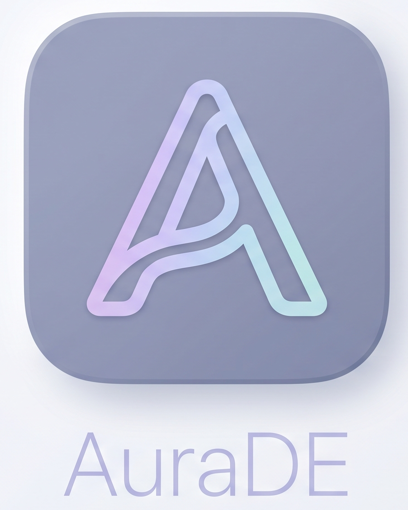

# AuraDE

  

AuraDE is a ChromeOS-inspired desktop for ordinary Arch Linux hardware. It
uses the Ash user interface while keeping the Linux kernel, hardware support,
NetworkManager, PipeWire, and systemd that already work on the machine.

This repository is a development preview. It is not an official Google or
ChromeOS distribution, and it is not a stable release. Do not install an
unsigned image on a machine that contains data you cannot restore.

## What AuraDE includes

- A graphical installer and a keyboard-first text installer.
- Local Linux accounts and a simple first-login path.
- Wayland desktop session support with software-rendering fallback.
- Files, Settings, Terminal, Diagnostics, audio, power, display, and
  accessibility integration.
- A NetworkManager bridge for the ChromeOS-style network surface.
- Btrfs snapshots and recovery tools when the selected layout supports them.
- Optional local assistant features that are disabled in the base profile.
- Arch package recipes, an ordered Chromium patch series, tests, and an ISO
  profile.

The graphical installer is part of the 0.2.0 development line. It is not
included in any 0.1.0 release artifact.

## Start here

- [Building](BUILDING.md) explains the package, Chromium, and ISO workflows.
- [Testing](TESTING.md) explains checks that can run without publishing private
  machine data.
- [Troubleshooting](TROUBLESHOOTING.md) covers common build and installation
  problems.
- [Hardware validation](docs/hardware-validation.md) records the public
  qualification matrix.
- [Contributing](CONTRIBUTING.md) describes review and test expectations.
- [Security](SECURITY.md) explains how to report a vulnerability privately.

## Repository layout

| Path | Purpose |
| --- | --- |
| patches/ | Ordered Chromium source patches (patches/SERIES) |
| chromiumos-ash/ | Ash package and Linux session launcher |
| aurade-* | AuraDE support packages |
| shill-nm-adapter/ | NetworkManager to Shill D-Bus bridge |
| ci/ | Source, package, release, and smoke checks |
| installer/ | ArchISO profile, installers, and recovery tools |
| assets/ | Brand artwork and public media |

Chromium is intentionally not vendored here. The pinned source revision is
recorded in pins/chromium.sha, and the patch series is applied in the order
listed by patches/SERIES.

## Quick checks

On an Arch Linux host, or inside a suitable Arch build environment:

~~~bash
git diff --check
AURADE_VERIFY_CHROMIUMOS_ASH=0 ci/arch-package-smoke.sh
ci/source-integrity-gate.sh
ci/public-release-leak-gate.sh
~~~

To inspect the complete workflow without changing the host:

~~~bash
./build-aurade.sh --plan --all
~~~

The first Chromium build is large and can take hours. Keep checkouts, package
caches, ISO files, VM images, and logs outside the Git checkout. The scripts
use AURADE_WORKDIR for that purpose.

## Installation and support

Use a matching checksum and release notice for every image. The installer
shows the selected disk, repeats its identity immediately before the erase
gate, and keeps the text path available when graphics are unavailable.

AuraDE is developed in public through GitHub issues and discussions. When
asking for help, include the release or commit, hardware family, and the exact
user-visible error. Remove passwords, API keys, serial numbers, private logs,
and network addresses before posting.

## Licensing

AuraDE-authored packaging, helpers, scripts, and documentation use the license
in LICENSE. ChromiumOS, Ash, and third-party components retain their own
licenses and notices. See THIRD_PARTY_NOTICES.md.
