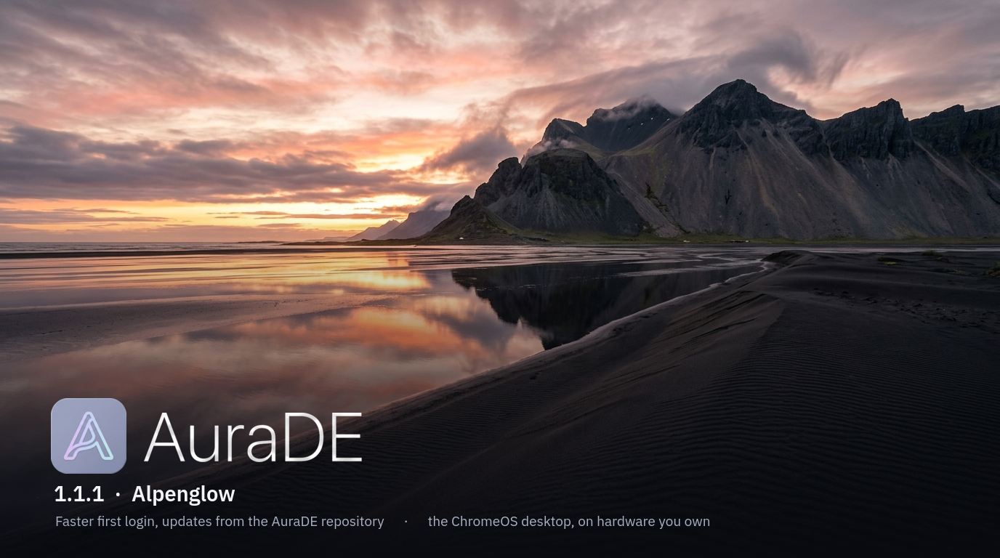

# AuraDE

<p align="center">
  
</p>

AuraDE is a ChromeOS-inspired desktop for ordinary Arch Linux hardware. It
uses the Ash user interface while keeping the Linux kernel, hardware support,
NetworkManager, PipeWire, and systemd that already work on the machine.
Underneath it is plain Arch: pacman, the Arch kernel, and your own local
account, with no Google account needed.

AuraDE 1.1.1 is the current release. The ISO, the signed package
repository, and the release key are on the
[releases page](https://github.com/Cam396/aurade/releases/latest). AuraDE is
not an official Google or ChromeOS distribution. Back up anything you cannot
restore before you install it.

## Try it in a virtual machine

One command downloads the latest ISO, checks it against its published
SHA-256 (and the release signature when gpg is installed), makes a virtual
disk, and boots the installer. Run it again after installing to start AuraDE.

**Linux or an Intel Mac** (QEMU by default; libvirt and VirtualBox too):

```sh
curl -fsSL https://raw.githubusercontent.com/Cam396/aurade/main/vm/aurade-vm.sh | bash
```

**Windows** (Hyper-V from an administrator PowerShell, or VirtualBox):

```powershell
irm https://raw.githubusercontent.com/Cam396/aurade/main/vm/aurade-vm.ps1 | iex
```

Everything stays in one folder (`~/AuraDE`). The VM needs 4 GB of memory and a
30 GB disk at least. Apple Silicon Macs cannot run it, because AuraDE is built
for x86_64 PCs. [Virtual machines](docs/virtual-machines.md) has the settings,
other hypervisors, and what to expect from graphics in a VM.

## How it compares with ChromeOS Flex

| | AuraDE | ChromeOS Flex |
| --- | --- | --- |
| Made by | An independent open source project | Google |
| Underneath | Arch Linux, which you can use and change | A locked system image |
| Accounts | Local Linux accounts | A Google account, or guest mode |
| Software | The browser, web apps, and pacman and the AUR underneath | The browser, web apps, a Linux container |
| Hardware | What the Arch kernel supports | Google's certified models list |
| Updates | pacman, when you choose | Automatic, from Google |
| Android apps | No | No |

Flex is the polished, supported choice if you want ChromeOS on a PC. AuraDE is
for people who want that interface on a Linux system they own.

## Security updates

Be aware of this before you rely on AuraDE: its desktop and browser are built
from a Chromium 156 development snapshot (156.0.8060.0). They do not get
Chromium's upstream security fixes as those are released. Arch packages
(the kernel, systemd, NetworkManager and the rest) update through pacman as
usual. Moving the desktop to a current Chromium release is planned. Until
then, treat the built-in browser as you would any development build.

## What AuraDE includes

- A graphical installer and a keyboard-first text installer.
- Local Linux accounts and a simple first-login path.
- Wayland desktop session support with software-rendering fallback.
- Files, Settings, Terminal, Diagnostics, audio, power, display, and
  accessibility integration.
- A NetworkManager bridge for the ChromeOS-style network surface.
- Btrfs snapshots and recovery tools when the selected layout supports them.
- Optional local assistant features that are disabled in the base profile.
- Arch package recipes, an ordered Chromium patch series, tests, and an ISO
  profile.

The ISO starts the graphical installer by default, and the text installer
is on the same boot menu. Installed systems sign in on the graphical login
screen.

## Start here

- [Building](BUILDING.md) explains the package, Chromium, and ISO workflows.
- [Testing](TESTING.md) explains checks that can run without publishing private
  machine data.
- [Troubleshooting](TROUBLESHOOTING.md) covers common build and installation
  problems.
- [Hardware validation](docs/hardware-validation.md) records the public
  qualification matrix.
- [Contributing](CONTRIBUTING.md) describes review and test expectations.
- [Security](SECURITY.md) explains how to report a vulnerability privately.

## Repository layout

| Path | Purpose |
| --- | --- |
| patches/ | Ordered Chromium source patches (patches/SERIES) |
| chromiumos-ash/ | Ash package and Linux session launcher |
| aurade-* | AuraDE support packages |
| shill-nm-adapter/ | NetworkManager to Shill D-Bus bridge |
| ci/ | Source, package, release, and smoke checks |
| installer/ | ArchISO profile, installers, and recovery tools |
| assets/ | Brand artwork and public media |

Chromium is intentionally not vendored here. The pinned source revision is
recorded in pins/chromium.sha, and the patch series is applied in the order
listed by patches/SERIES.

## Quick checks

On an Arch Linux host, or inside a suitable Arch build environment:

~~~bash
git diff --check
AURADE_VERIFY_CHROMIUMOS_ASH=0 ci/arch-package-smoke.sh
ci/source-integrity-gate.sh
ci/public-release-leak-gate.sh
~~~

To inspect the complete workflow without changing the host:

~~~bash
./build-aurade.sh --plan --all
~~~

The first Chromium build is large and can take hours. Keep checkouts, package
caches, ISO files, VM images, and logs outside the Git checkout. The scripts
use AURADE_WORKDIR for that purpose.

## Installation and support

Use a matching checksum and release notice for every image. The installer
shows the selected disk, repeats its identity immediately before the erase
gate, and keeps the text path available when graphics are unavailable.

Already running Arch? AuraDE installs next to your current desktop as one more
session at your login screen, and comes back out with one command. See
[AuraDE on an Arch system you already use](docs/existing-arch.md).

### Updates

`sudo pacman -Syu` updates AuraDE along with Arch. Installs from 1.1.1 on
already do this. A machine installed from 1.0.0 or 1.1.0 only reads the copy
of the repository on its own disk, so it never sees an update until this is
run once. It adds the online repository ahead of that copy, which stays as a
fallback, and then updates:

<!-- enable-updates -->
```sh
grep -q Cam396/aurade /etc/pacman.d/aurade-mirrorlist || sudo sed -i '1i Server = https://github.com/Cam396/aurade/releases/download/repo-x86_64' /etc/pacman.d/aurade-mirrorlist; sudo pacman -Syu
```

Running it again changes nothing, so it is safe to paste on any AuraDE
machine.

AuraDE is developed in public through
[GitHub issues](https://github.com/Cam396/aurade/issues) and
[discussions](https://github.com/Cam396/aurade/discussions). If you install it
on real hardware, a
[hardware report](https://github.com/Cam396/aurade/issues/new?template=hardware-report.yml)
helps, whether everything worked or nothing did. When asking for help,
include the release or commit, hardware family, and the exact user-visible
error. Remove passwords, API keys, serial numbers, private logs,
and network addresses before posting.

## Licensing

AuraDE-authored packaging, helpers, scripts, and documentation use the license
in LICENSE. ChromiumOS, Ash, and third-party components retain their own
licenses and notices. See THIRD_PARTY_NOTICES.md.
